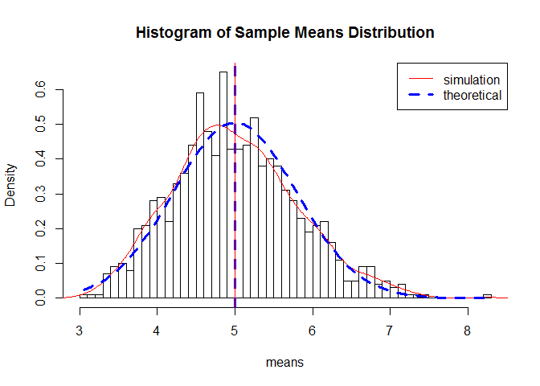
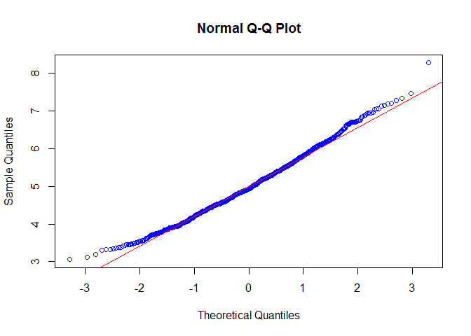

# Statistical Inference: Course Project
Created by H.Wang on November 19, 2015

## Basic Settings

```r
echo= TRUE  # make scripts visible to others
```
## Description of the Problem

The exponential distribution can be simulated in R with rexp(n, lambda) where lambda is the rate parameter. The mean of exponential distribution is 1/lambda and the standard deviation is also 1/lambda. Set lambda = 0.2 for all of the simulations. Investigate the distribution of averages of 40 exponentials, need to do a thousand or so simulated averages of 40 exponentials. Illustrate via simulation and associated explanatory text the properties of the distribution of the mean of 40 exponentials.

## Simulations

```r
library(ggplot2)
# simulation constants
lambda <- 0.2
n <- 40
sim_num<- 1000 #simulation number

# set the seed to reproduce simluation sample values
set.seed(5523028)

# run the simulation in 1000*40 matrix
exp_dist <- matrix(data= rexp(n*sim_num, lambda),nrow= sim_num)
exp_dist_mean <- data.frame(means = apply(exp_dist, 1, mean))
```

## Sample Mean vs. Theoretical Mean

```r
t_mean <- 1/lambda #theoretical Mean
s_mean <- mean(exp_dist_mean$means) #simulation Mean

t_mean 
```

```
## [1] 5
```

```r
s_mean
```

```
## [1] 5.003705
```
As comparison, the average sample mean and expected mean are very close. 

## Sample Variance vs. Theoretical Variance

```r
t_var <- (1/lambda/sqrt(n))^2 #theoretical variance
s_var <- var(exp_dist_mean$means) #simulation variance

t_var
```

```
## [1] 0.625
```

```r
s_var
```

```
## [1] 0.6423574
```
As comparison, both variance are very close. Since variance is the square of the standard deviations, minor differences will be enhanced but are still pretty close. 

## Distribution
Comparing the population means & standard deviation with a normal distribution of the expected values. Lines for the simulated and expected means are added.

 

Therefore, the distribution of averages of 40 exponentials is centered at 5.0037045 and the same is close to the theoretical center of the distribution, which is $\lambda^{-1}$ = 5.

 

Because of the central limit theorem, the averages of samples follow normal distribution. The Q-Q plot suggests the distribution of 40 exponentials is very close to a normal distribution. 

